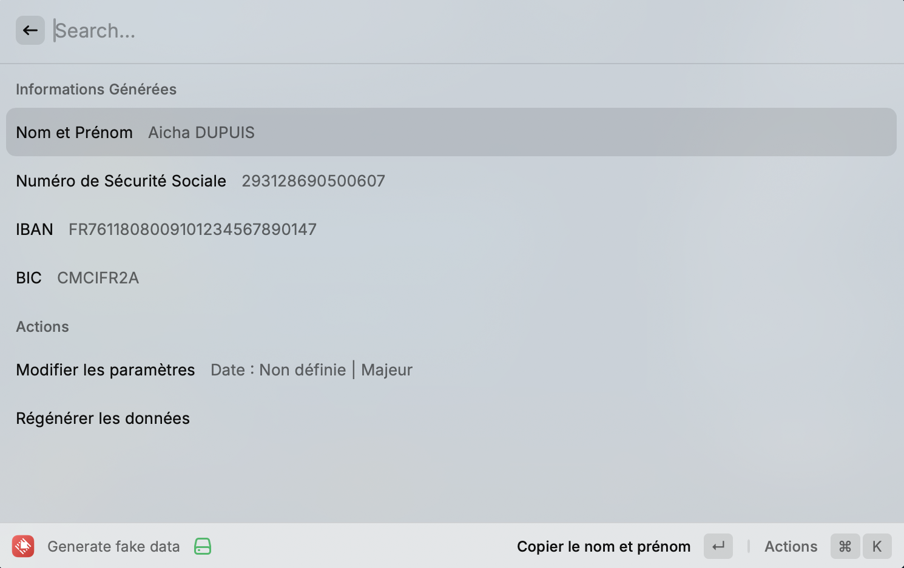
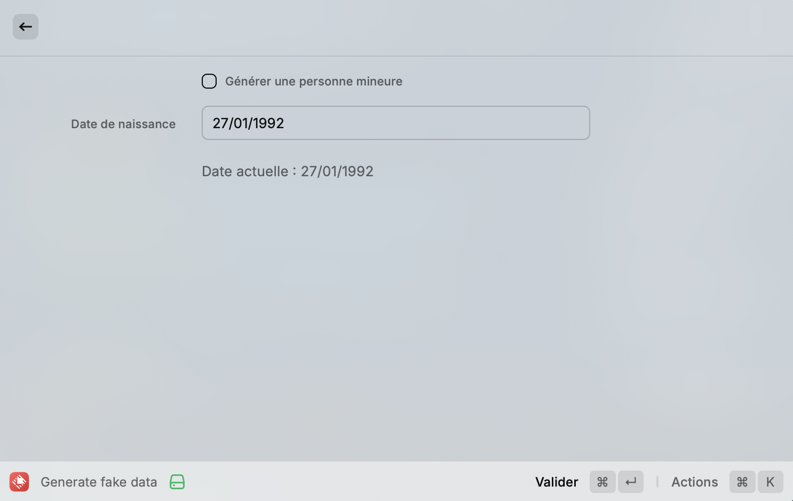

# SSN & IBAN Fake Data Generator

A simple and efficient Raycast extension to generate realistic fake data including Social Security Numbers (SSNs), IBANs, BICs, and random names. This tool is perfect for developers, testers, or anyone needing placeholder data with realistic formatting.

---

## 🚀 Features

- **Generate Random Data**:
  - Social Security Number (SSN) with realistic formatting.
  - IBAN and BIC from predefined French bank samples.
  - Random names (male and female) with common French first and last names.
- **Customizable Options**:
  - Specify date of birth for SSN generation.
  - Choose gender for name generation (male/female).
  - Checkbox to generate data for minors or adults.
- **Copy to Clipboard**: Each data field is easily copied to your clipboard with one click.

---

## 📸 Screenshots

### Main Interface



### Edit Date of Birth



---

## 🛠 Installation

1. Clone the repository:

   ```bash
   git clone https://github.com/yourusername/ssn-iban-generator.git
   ```

2. Navigate to the project directory:

   ```bash
   cd ssn-iban-generator
   ```

3. Install dependencies:

   ```bash
   npm install
   ```

4. Run the extension in development mode:

   ```bash
   npm run dev
   ```

5. Add the extension to Raycast for testing.

### 📋 Usage

Launch the extension in Raycast.
Use the "Regenerate Data" action to create new random data.
Edit the date of birth by selecting "Modify Date of Birth".
Use the checkbox to generate data for minors or adults.
Click on any field to copy its value to your clipboard.

Thx for using this extension! 🎉
